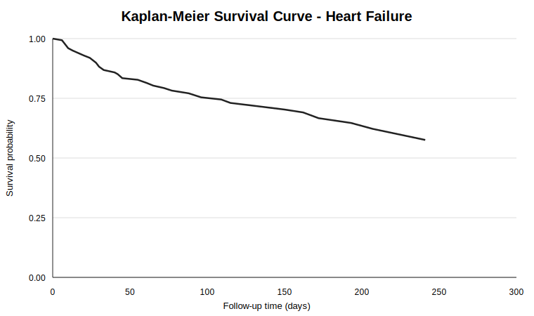
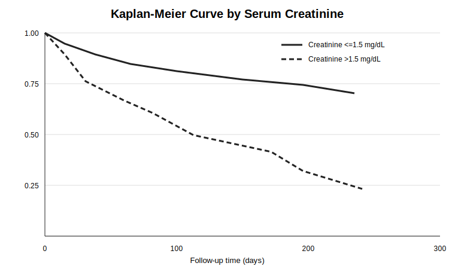
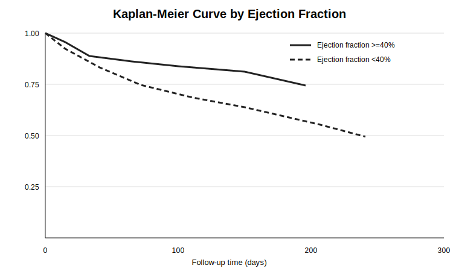
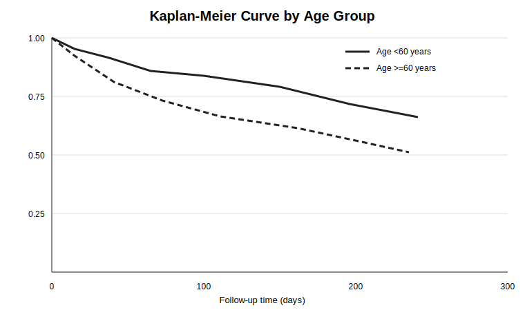

# Heart Failure Survival Analysis Using Kaplan-Meier and Cox Regression


[](LICENSE)

A reproducible biostatistics project examining **time to death among patients with heart failure** using Kaplan-Meier estimation, log-rank tests, and Cox proportional hazards regression in Stata.

**Author:** Mohammad Maliki Rafli  
**Program:** Master of Public Health, Universitas Airlangga

## Table of Contents

- [Project Overview](#project-overview)
- [Project Report](#project-report)
- [Research Objectives](#research-objectives)
- [Repository Structure](#repository-structure)
- [Dataset](#dataset)
- [Analytical Workflow](#analytical-workflow)
- [Statistical Methods](#statistical-methods)
- [Key Results](#key-results)
- [Selected Visualizations](#selected-visualizations)
- [Data Access](#data-access)
- [Reproducing the Analysis](#reproducing-the-analysis)
- [Interpretation](#interpretation)
- [Limitations](#limitations)
- [Conclusion](#conclusion)
- [Recommendations](#recommendations)
- [License and Academic Use](#license-and-academic-use)
- [Contact](#contact)

## Project Overview

Survival analysis evaluates both whether an event occurs and how long it takes to occur. In this project, the event of interest is **death during follow-up**, while patients without a recorded death are treated as censored observations.

The analysis describes patient characteristics, estimates survival probabilities, compares clinically relevant survival curves, identifies factors associated with mortality, and evaluates the proportional hazards assumption. The public repository contains the analytical report, Stata do-file, aggregate result tables, and non-identifiable Kaplan-Meier visualizations.

## Project Report

- [Read the complete analytical report](01_Laporan/Heart_Failure_Survival_Analysis_Report.md)
- [View the Stata analysis script](02_Script/Heart_Failure_Survival_Analysis.do)

## Research Objectives

1. Describe the demographic and clinical characteristics of patients with heart failure.
2. Estimate overall survival probabilities using the Kaplan-Meier method.
3. Compare survival curves across clinically relevant groups using log-rank tests.
4. Estimate crude and adjusted hazard ratios using Cox proportional hazards regression.
5. Assess the proportional hazards assumption using Schoenfeld-residual tests.

## Repository Structure

```text
.
├── 01_Laporan/
│   └── Heart_Failure_Survival_Analysis_Report.md
├── 02_Script/
│   └── Heart_Failure_Survival_Analysis.do
├── 03_Data/
│   └── README.md
├── 04_Output/
│   ├── final_cox_model_results.csv
│   ├── kaplan_meier_estimates.csv
│   ├── log_rank_test_results.csv
│   ├── km_overall_heart_failure.svg
│   ├── km_age_ge60.svg
│   ├── km_ef_low40.svg
│   └── km_creatinine_high.svg
├── .gitignore
├── CITATION.cff
├── LICENSE
├── LICENSE-CONTENT.md
└── README.md
```

The `03_Data/` directory contains dataset documentation only. The analytical dataset is intentionally excluded from this repository, following the same data-governance pattern used in the CKD project.

## Dataset

The analysis uses the **Heart Failure Clinical Records** dataset from the UCI Machine Learning Repository. It contains **299 patient records** and 13 variables, including follow-up time and death-event status.

| Variable | Description | Unit / coding |
|---|---|---|
| `age` | Patient age | Years |
| `anaemia` | Anaemia status | 0 = no; 1 = yes |
| `creatinine_phosphokinase` | Creatinine phosphokinase level | mcg/L |
| `diabetes` | Diabetes status | 0 = no; 1 = yes |
| `ejection_fraction` | Percentage of blood ejected per contraction | % |
| `high_blood_pressure` | High-blood-pressure status | 0 = no; 1 = yes |
| `platelets` | Platelet count | platelets/mL |
| `serum_creatinine` | Serum creatinine | mg/dL |
| `serum_sodium` | Serum sodium | mEq/L |
| `sex` | Sex | 0 = female; 1 = male |
| `smoking` | Smoking status | 0 = no; 1 = yes |
| `time` | Follow-up duration | Days |
| `DEATH_EVENT` | Death during follow-up | 0 = censored/alive; 1 = death |

Dataset provenance, citation, licensing, and placement instructions are documented in [`03_Data/README.md`](03_Data/README.md).

## Analytical Workflow

1. Import and validate the clinical-record dataset.
2. Inspect observations, variable structure, missingness, and duplicate records.
3. Create rescaled continuous predictors and clinically interpretable grouping variables.
4. Declare survival data using `stset time, failure(death_event==1)`.
5. Estimate overall Kaplan-Meier survival probabilities.
6. Compare survival curves using log-rank tests.
7. Fit univariable Cox regression models.
8. Fit full and parsimonious multivariable Cox models using the Efron method for tied events.
9. Evaluate proportional hazards using Schoenfeld-residual tests.
10. Export aggregate result tables and Kaplan-Meier figures.

## Statistical Methods

### Kaplan-Meier analysis

The Kaplan-Meier estimator was used to estimate the survival function and survival probabilities at days 30, 60, 90, 180, and 270. Log-rank tests compared survival functions across categorical clinical groups.

### Cox proportional hazards regression

The Cox model was specified as:

$$
h(t \mid X) = h_0(t)\exp(\beta_1X_1 + \cdots + \beta_pX_p)
$$

where $h(t \mid X)$ is the hazard at time $t$, $h_0(t)$ is the baseline hazard, and $\exp(\beta_j)$ represents the hazard ratio associated with predictor $X_j$.

Both univariable and multivariable models were estimated. Results are presented as hazard ratios, 95% confidence intervals, and p-values.

## Key Results

### Survival summary

| Measure | Result |
|---|---:|
| Patients | 299 |
| Deaths | 96 (32.11%) |
| Censored observations | 203 (67.89%) |
| Median follow-up | 115 days |
| Total observed time | 38,948 patient-days |
| Mortality incidence rate | 2.46 per 1,000 patient-days |
| Median survival | Not reached |

### Kaplan-Meier estimates

| Follow-up day | Survival probability | 95% CI |
|---:|---:|---:|
| 30 | 0.8823 | 0.8399-0.9140 |
| 60 | 0.8172 | 0.7682-0.8569 |
| 90 | 0.7627 | 0.7092-0.8076 |
| 180 | 0.6543 | 0.5892-0.7117 |
| 270 | 0.5757 | 0.4919-0.6507 |

Log-rank tests identified statistically significant survival differences for high blood pressure, age >=60 years, ejection fraction <40%, serum creatinine >1.5 mg/dL, and serum sodium <135 mEq/L.

### Final multivariable Cox model

| Predictor | Adjusted HR | 95% CI | p-value |
|---|---:|---:|---:|
| Age, per year | 1.045 | 1.027-1.063 | <0.001 |
| Anaemia | 1.562 | 1.025-2.381 | 0.038 |
| CPK, per 100 mcg/L | 1.021 | 1.002-1.041 | 0.033 |
| Ejection fraction, per 1% | 0.954 | 0.935-0.973 | <0.001 |
| High blood pressure | 1.643 | 1.081-2.498 | 0.020 |
| Serum creatinine, per 1 mg/dL | 1.369 | 1.196-1.567 | <0.001 |
| Serum sodium, per 1 mEq/L | 0.955 | 0.913-1.000 | 0.050 |

The global Schoenfeld-residual test did not indicate a violation of the proportional hazards assumption for either the full model (`p = 0.5792`) or final model (`p = 0.3447`).

Aggregate results are available in [`04_Output/`](04_Output/).

## Selected Visualizations

### Overall Kaplan-Meier survival curve



### Survival by serum creatinine group



### Survival by ejection-fraction group



### Survival by age group



## Data Access

The analytical CSV is not redistributed in this repository. Users can obtain the original dataset from the UCI Machine Learning Repository and must comply with its attribution requirements.

Dataset citation:

> UCI Machine Learning Repository. (2020). *Heart Failure Clinical Records* [Dataset]. https://doi.org/10.24432/C5Z89R

Associated publication:

> Chicco, D., & Jurman, G. (2020). Machine learning can predict survival of patients with heart failure from serum creatinine and ejection fraction alone. *BMC Medical Informatics and Decision Making, 20*, 16. https://doi.org/10.1186/s12911-020-1023-5

## Reproducing the Analysis

1. Clone the repository:

   ```bash
   git clone https://github.com/mohmalikirafli/heart-failure-survival-analysis.git
   cd heart-failure-survival-analysis
   ```

2. Obtain the authorized dataset and place it at:

   ```text
   03_Data/heart_failure_clinical_records.csv
   ```

3. Start Stata and set the working directory to the repository root.

4. Run the do-file:

   ```stata
   do "02_Script/Heart_Failure_Survival_Analysis.do"
   ```

Generated files will be written to `04_Output/`.

## Interpretation

After adjustment for the other predictors retained in the final model, older age, anaemia, higher CPK, high blood pressure, and higher serum creatinine were associated with a higher hazard of death. Higher ejection fraction was associated with a lower hazard. Serum sodium showed a protective direction with a boundary p-value of 0.050.

These estimates describe associations within this dataset. They do not establish causality and do not constitute a validated clinical prognostic model.

## Limitations

- The dataset contains 299 patients and 96 deaths, limiting model complexity and estimate precision.
- The analysis uses secondary observational data and may remain affected by residual confounding and selection bias.
- Continuous predictors were modeled linearly without formal assessment of nonlinear functional forms.
- Dichotomized clinical variables were used for descriptive Kaplan-Meier comparisons and may lose information.
- The final model was developed for an academic exercise and has not undergone external validation.
- The findings must not be used for diagnosis, prognosis, or treatment decisions.

## Conclusion

Survival declined progressively throughout follow-up, although median survival was not reached. Age, anaemia, CPK, ejection fraction, high blood pressure, serum creatinine, and serum sodium were retained in the final Cox model. Serum creatinine, ejection fraction, age, and high blood pressure showed the most consistent relationships across descriptive survival analysis, log-rank testing, and Cox regression.

## Recommendations

- Evaluate nonlinear effects using restricted cubic splines or fractional polynomials.
- Assess influential observations, interactions, and model stability through resampling.
- Validate the final model in an independent clinical population.
- Report calibration and discrimination measures when extending the analysis toward prediction.
- Avoid categorizing continuous predictors for regression modeling unless clinically justified.

## License and Academic Use

The source code is available under the [MIT License](LICENSE). The README, analytical report, original figures, and other author-created academic materials are available under [CC BY 4.0](LICENSE-CONTENT.md).

The UCI dataset remains governed by its original license and attribution requirements. Institutional names and logos, trademarks, and cited or reproduced third-party materials remain the property of their respective owners.

This project is intended for education, research, and portfolio demonstration—not for clinical diagnosis or medical decision-making.

## Contact

For questions, academic discussion, collaboration, or legitimate inquiries about the analysis, contact **Mohammad Maliki Rafli** through the [GitHub profile](https://github.com/mohmalikirafli) or open an [issue](https://github.com/mohmalikirafli/heart-failure-survival-analysis/issues) in this repository.

---

This repository is intended for academic and portfolio purposes in biostatistics, epidemiology, and health data science.